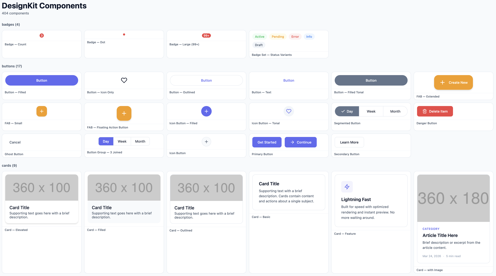
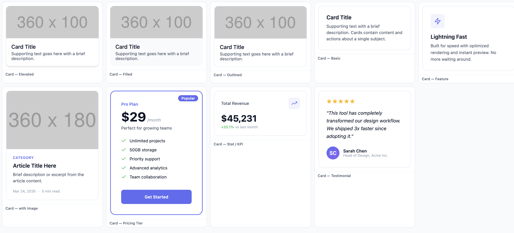
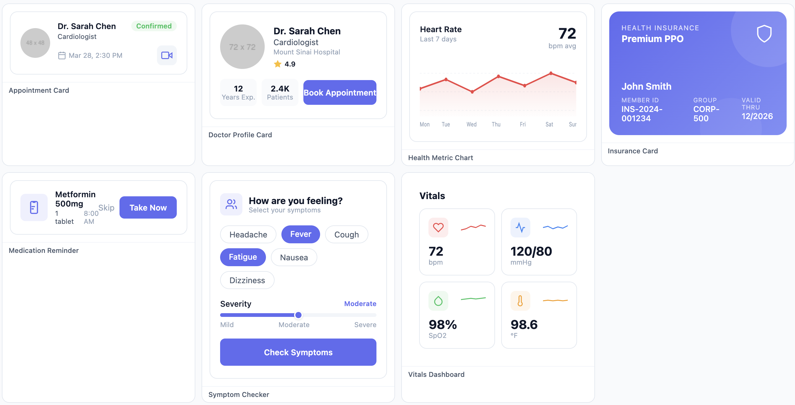
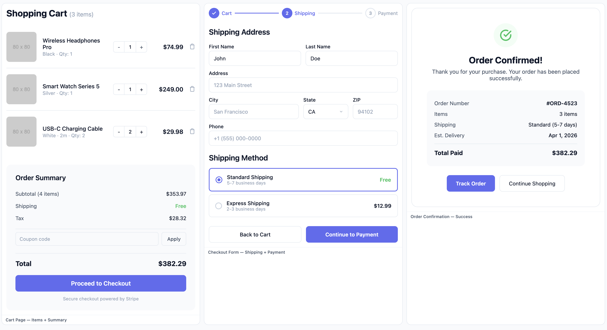
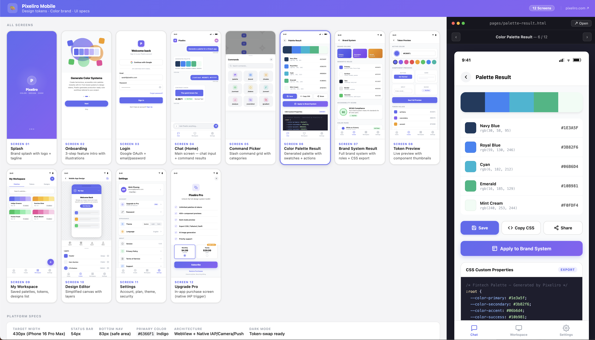
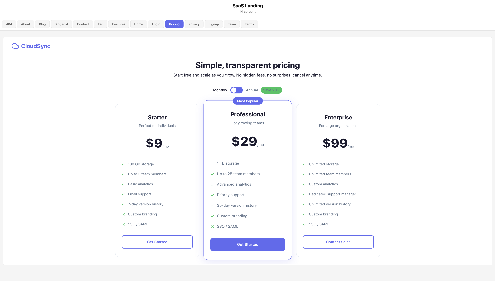

# DesignKit — HTML UI Component Library

> **502 ready-to-use HTML components** + **33 full-page design previews** for Web and Mobile.
> Token-based design system. Works with any AI agent to generate beautiful single-file HTML designs.
> Built by **[Pixeliro](https://pixeliro.com)** — AI-powered design tool for everyone.

---

## Why DesignKit?

### Design-first, then build

The most common bottleneck in app development isn't coding — it's not knowing what to build. DesignKit solves this by letting you **design first in plain HTML**, then convert to any stack.

```
Idea → HTML prototype (minutes) → Ship to React / Vue / SwiftUI / Flutter / ...
```

No Figma license. No design handoff. No waiting. Just open an HTML file, see the UI, and start building.

---

### Useful in design

- **Instant visual prototypes** — 502 components + 33 full-page designs ready to open in any browser. No build step, no setup.
- **Token-driven theming** — change one CSS variable (`--kit-primary`) and the entire design recolors. Perfect for testing brand colors, dark mode, or client themes in seconds.
- **AI-ready structure** — feed components to Claude, GPT-4, or Gemini. The AI understands the token system and generates pixel-perfect screens that match your design language.
- **Mobile + Web in one kit** — 204 mobile components (iOS/Android) and 200 web components share the same token system, so mobile and web feel consistent by default.

---

### Useful in coding

- **Copy-paste HTML → any framework** — each component is a self-contained HTML snippet. Paste it into your project as-is, or ask an AI to convert it:

  ```
  "Convert this HTML component to a React component using Tailwind CSS"
  "Turn this into a Vue 3 <script setup> SFC"
  "Convert to SwiftUI View"
  "Rewrite as a Flutter Widget"
  ```

- **Reference UI, not guesswork** — instead of describing UI to an AI ("make a pricing card with a highlighted tier"), paste the HTML and say "implement this". The output is 10× more accurate.
- **Design tokens as a contract** — `--kit-primary`, `--kit-radius`, `--kit-shadow` work as a shared language between design and code. Map them to your Tailwind config, CSS-in-JS theme, or native style tokens once, and everything stays in sync.
- **Full-page designs as scaffolding** — open `previews/full-designs/web/dashboard/` and you have a complete SaaS dashboard with 10 pages. Use it as a starter, a reference, or hand it to an AI to scaffold your real app.

---

### Workflow examples

**Solo developer prototyping a SaaS app**
1. Browse `previews/full-designs/web/saas-landing/` — open `index.html` in browser
2. Pick the pages you need, swap colors via CSS tokens
3. Ask Claude: *"Convert this HTML page to Next.js + Tailwind, keep the same layout"*
4. Ship

**Designer handing off to a dev team**
1. Customize tokens in `css/tokens.css` to match the brand
2. Compose pages from components in `components/web/`
3. Send the HTML files — devs have pixel-perfect reference + working markup

**AI agent generating app screens**
1. Point the agent at [AI-AGENT.md](AI-AGENT.md)
2. Agent reads the token system and component library
3. Agent generates consistent, on-brand single-file HTML screens
4. Convert each screen to the target framework

---

## About Pixeliro

**[Pixeliro](https://pixeliro.com)** is an AI-powered design tool — create UI screens, social posts, marketing materials, and full app designs without design skills.

DesignKit is the component library that powers Pixeliro's editor and AI generation pipeline. Every component in this repo is live inside the app.

### Design Tools

| Tool | Link |
|------|------|
| AI Design Editor | [pixeliro.com](https://pixeliro.com) |
| UI Component Library | [pixeliro.com/design/components](https://pixeliro.com/design/components) |
| Mockup Generator | [pixeliro.com/design/mockups](https://pixeliro.com/design/mockups) |
| Design Tokens | [pixeliro.com/design-tokens](https://pixeliro.com/design-tokens) |
| Design Token Generator | [pixeliro.com/design-token-generator](https://pixeliro.com/design-token-generator) |

### Color Tools

| Tool | Link |
|------|------|
| Color Palette Generator | [pixeliro.com/color-palette-generator](https://pixeliro.com/color-palette-generator) |
| Color Generator | [pixeliro.com/color-generator](https://pixeliro.com/color-generator) |
| Gradient Generator | [pixeliro.com/gradient-generator](https://pixeliro.com/gradient-generator) |
| Color from Image | [pixeliro.com/color-palette-from-image](https://pixeliro.com/color-palette-from-image) |
| Color Shades | [pixeliro.com/color-shades-generator](https://pixeliro.com/color-shades-generator) |
| Contrast Checker | [pixeliro.com/contrast-checker](https://pixeliro.com/contrast-checker) |
| Color Accessibility | [pixeliro.com/color-accessibility-check](https://pixeliro.com/color-accessibility-check) |
| Color Converter | [pixeliro.com/color-converter](https://pixeliro.com/color-converter) |
| Brand Color Palette | [pixeliro.com/brand-color-palette](https://pixeliro.com/brand-color-palette) |
| Brand Palettes | [pixeliro.com/brand-palettes](https://pixeliro.com/brand-palettes) |

---





---


## What's inside

```
DesignKit/
├── components/
│   ├── app-mobile/     204 components  (iOS + Android unified)
│   ├── web/            200 components  (Responsive desktop/web)
│   └── common/          98 components  (Icons, illustrations, mockup elements)
│
└── previews/
    └── full-designs/
        ├── mobile/     17 complete app designs (Finance, Fitness, Food, Social, …)
        └── web/        16 complete web designs (SaaS, Analytics, Blog, CRM, …)
```

**Each component** is a self-contained HTML snippet using CSS custom properties (`--kit-*`).
**Each full design** includes tokenkit.json, CSS tokens, pages, components, and specs.

---

## Token System — `var(--kit-*)`

Every component uses **CSS custom properties**. Drop-in these variables to theme anything:

```css
:root {
  /* Colors */
  --kit-primary:      #6366F1;   /* brand color */
  --kit-primary-text: #FFFFFF;   /* text on primary */
  --kit-secondary:    #64748B;
  --kit-accent:       #F59E0B;
  --kit-bg:           #FFFFFF;   /* page background */
  --kit-surface:      #F8FAFC;   /* card, panel */
  --kit-surface-2:    #F1F5F9;   /* nested surfaces */
  --kit-text:         #0F172A;   /* primary text */
  --kit-text-2:       #475569;   /* secondary text */
  --kit-text-3:       #94A3B8;   /* caption, placeholder */
  --kit-text-inverse: #FFFFFF;
  --kit-border:       #E2E8F0;
  --kit-border-strong:#CBD5E1;
  --kit-success:      #22C55E;
  --kit-error:        #EF4444;
  --kit-warning:      #F59E0B;
  --kit-info:         #3B82F6;

  /* Typography */
  --kit-font:     'Inter', system-ui, -apple-system, sans-serif;
  --kit-text-xs:  11px;
  --kit-text-sm:  13px;
  --kit-text-md:  15px;
  --kit-text-lg:  17px;
  --kit-text-xl:  20px;
  --kit-text-2xl: 24px;
  --kit-text-3xl: 32px;
  --kit-text-4xl: 48px;

  /* Spacing */
  --kit-space-1:  4px;
  --kit-space-2:  8px;
  --kit-space-3:  12px;
  --kit-space-4:  16px;
  --kit-space-5:  20px;
  --kit-space-6:  24px;
  --kit-space-8:  32px;
  --kit-space-10: 40px;
  --kit-space-12: 48px;
  --kit-space-16: 80px;

  /* Border radius */
  --kit-radius-sm: 6px;
  --kit-radius:    10px;
  --kit-radius-lg: 14px;
  --kit-radius-xl: 20px;
  --kit-radius-full: 9999px;

  /* Shadows */
  --kit-shadow-sm: 0 1px 3px rgba(0,0,0,0.08);
  --kit-shadow:    0 4px 12px rgba(0,0,0,0.10);
  --kit-shadow-lg: 0 8px 32px rgba(0,0,0,0.12);
  --kit-shadow-xl: 0 20px 60px rgba(0,0,0,0.15);
}
```

Override any token to retheme all components instantly — no class changes needed.

---

## Component Format

Every component file follows this structure:

```html
<!--
  @name: Primary Button
  @kit: web
  @category: buttons
  @width: 320
  @height: 40
  @tags: button, primary, cta, action
-->
<div data-component="Primary Button" style="font-family:var(--kit-font, Inter, system-ui, sans-serif)">
  <button style="
    height: 40px;
    padding: 0 20px;
    background: var(--kit-primary, #6366F1);
    color: var(--kit-primary-text, #FFFFFF);
    border-radius: var(--kit-radius, 10px);
    border: none;
    font-size: var(--kit-text-sm, 13px);
    font-weight: 500;
    cursor: pointer;
  ">Get Started</button>
</div>
```

Rules:
- **Inline styles only** — no external CSS, no class dependencies
- **Self-contained** — copy-paste anywhere, it works
- **Semantic HTML** — `<button>`, `<nav>`, `<a>`, `<input>` (not div-soup)
- **No JavaScript** — pure HTML + CSS, static design previews
- **Placeholder images** — `https://placehold.jp/400x300.png`

---

## Components — App Mobile (204)

Platform: iOS + Android unified. Size reference: 390×844 (iPhone 14 Pro).

| Category | Count | Examples |
|----------|-------|---------|
| `navbars` | 8 | top-app-bar-small/medium/large/center, bottom-nav-3/4/5, bottom-app-bar |
| `buttons` | 11 | filled, tonal, outlined, text, icon, fab, fab-small, fab-extended, segmented |
| `cards` | 3 | elevated, filled, outlined |
| `inputs` | 10 | text-field, search-bar, select, date-picker, time-picker, otp, password, file-upload, textarea |
| `lists` | 3 | list-item-1line, 2line, 3line |
| `chips` | 4 | assist, filter, input, suggestion |
| `feedback` | 6 | snackbar, progress-linear, progress-circular, skeleton, banner, tooltip |
| `tabs` | 2 | primary-tabs, secondary-tabs |
| `toggles` | 3 | switch, checkbox, radio |
| `menus` | 2 | dropdown-menu, context-menu |
| `dialogs` | 2 | basic-dialog, fullscreen-dialog |
| `surfaces` | 4 | bottom-sheet, side-sheet, drawer, navigation-rail |
| `sliders` | 2 | continuous, discrete |
| `badges` | 3 | badge-dot, badge-count, badge-overflow |
| `dividers` | 2 | full-width, inset |
| `native` | 15 | ios-status-bar, ios-nav-bar, ios-tab-bar, ios-action-sheet, ios-alert, android-status-bar, gesture-nav, … |
| `patterns` | 47 | product-card, order-tracker, chat-bubble, contact-card, story-row, map-preview, … |
| `charts` | 7 | bar-chart, line-chart, donut-chart, progress-ring, sparkline, stat-card, horizontal-bar |
| `data-display` | 2 | grid-view, list-view |

**Full list:** [components/componentmap-app-mobile.md](components/componentmap-app-mobile.md)



---

## Components — Web (200)

Platform: Desktop/Web. Size reference: 1440px wide, responsive.

| Category | Count | Examples |
|----------|-------|---------|
| `navbars` | 6 | topnav, topnav-search, sidebar, sidebar-dark, breadcrumb, footer |
| `buttons` | 6 | primary, secondary, danger, ghost, icon, group |
| `cards` | 6 | basic, feature, image, pricing, stat, testimonial |
| `inputs` | 10 | text-input, textarea, select, search-command, date, file-upload, tag-input, checkbox, radio, toggle |
| `heroes` | 3 | hero-gradient, hero-image-bg, hero-video |
| `features` | 3 | icon-list, alternating-rows, bento-grid |
| `cta` | 3 | centered, split-image, newsletter |
| `pricing` | 2 | comparison-table, monthly-annual |
| `social-proof` | 2 | logo-cloud, testimonials |
| `layout` | 6 | hero-centered, hero-split, features-grid, pricing-section, stats-row, cta-banner |
| `tables` | 2 | simple-table, data-table |
| `modals` | 2 | basic, form |
| `feedback` | 8 | alert, empty-state, loading, progress-bar, skeleton, toast-success, toast-error, tooltip |
| `charts` | 3 | area-chart, bar-chart, donut-chart |
| `widgets` | 8 | api-keys, billing, changelog, onboarding, settings, stats, team, usage |
| `patterns` | 22 | auth-login, kanban-board, chat-interface, calendar, settings-page, … |
| `products` | 4 | product-card, product-detail, product-grid, review-section |
| `cart` | 3 | cart-page, checkout, order-confirmation |
| `account` | 3 | profile, subscription, payment-method |

**Full list:** [components/componentmap-web.md](components/componentmap-web.md)



---

## Components — Common (98)

Shared across both kits.

| Category | Count | Description |
|----------|-------|-------------|
| `ui-icons` | ~40 | SVG icons: actions, navigation, media, commerce, social, data, status… |
| `illustrations` | ~30 | Empty states, onboarding, error, success illustrations |
| `decorations` | ~18 | Gradient blobs, patterns, dividers, abstract shapes |
| `mockup-elements` | ~10 | Phone frame, browser frame, screen bezels |

---

## Full Design Previews (33)

Pre-built complete designs. Each includes multiple pages + tokenkit.json.

### Mobile (17)

| Design | Pages | Description |
|--------|-------|-------------|
| `finance` | 20 | Banking: dashboard, transactions, cards, budget, send money |
| `fitness` | 15 | Workout tracker, plans, progress, timer |
| `food` | 14 | Food delivery: restaurants, menu, cart, tracking |
| `ecommerce` | 18 | Shopping: catalog, product detail, cart, checkout |
| `social` | 16 | Social network: feed, stories, profile, messages |
| `chat` | 12 | Messaging: inbox, conversation, calls, contacts |
| `healthcare` | 15 | Health: appointments, vitals, records, doctors |
| `education` | 14 | Courses: browse, lesson, quiz, progress |
| `music` | 12 | Player, playlists, library, artist |
| `news` | 10 | Feed, categories, article, bookmarks |
| `realestate` | 14 | Listings, map view, property detail, saved |
| `travel` | 15 | Flights, hotels, itinerary, booking |
| `weather` | 8 | Today, forecast, radar, cities |
| `todo` | 10 | Tasks, projects, calendar, focus |
| `dating` | 12 | Swipe, match, chat, profile |



### Web (16)

| Design | Pages | Description |
|--------|-------|-------------|
| `saas-landing` | 8 | Landing: hero, features, pricing, testimonials, blog, auth |
| `dashboard` | 10 | Analytics dashboard: overview, charts, tables, reports |
| `analytics` | 8 | Data platform: KPIs, funnels, cohorts, exports |
| `crm` | 10 | CRM: pipeline, contacts, deals, activities |
| `ecommerce-store` | 12 | Store: catalog, product, cart, checkout, orders |
| `blog` | 8 | Blog: home, article, category, author, search |
| `auth` | 6 | Auth flows: login, signup, forgot, verify, onboarding |
| `agency` | 8 | Agency site: home, services, portfolio, about, contact |
| `portfolio` | 6 | Portfolio: home, projects, case study, about |
| `courses` | 10 | E-learning: browse, course, lesson, quiz, certificate |
| `project-mgmt` | 8 | Project tool: board, list, gantt, team, settings |
| `docs` | 6 | Documentation: home, guide, api-ref, changelog |
| `job-board` | 8 | Jobs: browse, detail, apply, company, profile |
| `events` | 8 | Events: browse, detail, tickets, schedule |
| `restaurant` | 6 | Restaurant: menu, reservation, about, catering |



### Full design structure

```
previews/full-designs/mobile/finance/
├── tokenkit.json       ← Design tokens (colors, typography, spacing, radii, shadows)
├── css/
│   └── tokens.css      ← Generated CSS vars (:root { --kit-primary: ... })
├── index.html          ← Gallery of all pages
├── pages/              ← Individual screen HTML files
│   ├── dashboard.html
│   ├── transactions.html
│   └── ...
├── components/         ← Design-specific components
├── layout/             ← AppShell.html
├── ui/                 ← UI primitives (Button, Card, Input...)
├── common/             ← Shared: logo, icons, typography, colors
├── assets/             ← Images, fonts (README with asset credits)
└── specs/
    └── README.md       ← Design spec: screens, platform, token reference
```

---

## How to use

### 1. Copy a component

Open any `.html` file in `components/`, copy the HTML content, paste into your project.
Make sure `var(--kit-*)` tokens are defined (copy from any `css/tokens.css`).

### 2. Browse full designs

Open `previews/full-designs/mobile/finance/index.html` in a browser — it shows all pages in a gallery.
Open individual pages to see the full design at device size.

### 3. Use with AI (recommended)

See **[AI-AGENT.md](AI-AGENT.md)** — a prompt/instructions file for AI agents (Claude, GPT-4, Gemini, Cursor, Copilot) to:
- Read this kit
- Understand the token system
- Generate single-file HTML designs (page or screen)
- Stay consistent with the design system

### 4. Customize tokens

Override any `--kit-*` variable to retheme:

```html
<style>
  :root {
    --kit-primary: #EF4444;       /* red brand */
    --kit-font: 'Poppins', sans-serif;
    --kit-radius: 4px;            /* sharper corners */
    --kit-bg: #0F172A;            /* dark mode */
    --kit-surface: #1E293B;
    --kit-text: #F1F5F9;
  }
</style>
```

---

## Single-file HTML output

AI agents using this kit generate **self-contained single HTML files**:

```html
<!DOCTYPE html>
<html lang="en">
<head>
  <meta charset="UTF-8">
  <meta name="viewport" content="width=390">  <!-- mobile: 390, desktop: 1440 -->
  <title>Screen Name</title>
  <style>
    /* 1. Kit tokens */
    :root { --kit-primary: #6366F1; ... }

    /* 2. Minimal reset */
    *, *::before, *::after { box-sizing: border-box; margin: 0; padding: 0; }
    body { font-family: var(--kit-font); background: var(--kit-bg); color: var(--kit-text); }

    /* 3. Screen wrapper */
    .screen { width: 390px; min-height: 844px; margin: 0 auto; overflow: hidden; position: relative; }
  </style>
</head>
<body>
  <div class="screen">
    <!-- components go here, inline styles -->
  </div>
</body>
</html>
```

---

## License

MIT — free for personal and commercial use. No attribution required.

---

## Related

- [AI-AGENT.md](AI-AGENT.md) — How to use this kit with AI agents
- [components/_index.md](components/_index.md) — Full component catalog
- [components/app-mobile/README.md](components/app-mobile/README.md) — Mobile kit docs
- [components/web/README.md](components/web/README.md) — Web kit docs
- [pixeliro.com](https://pixeliro.com) — Live design tool using this kit
